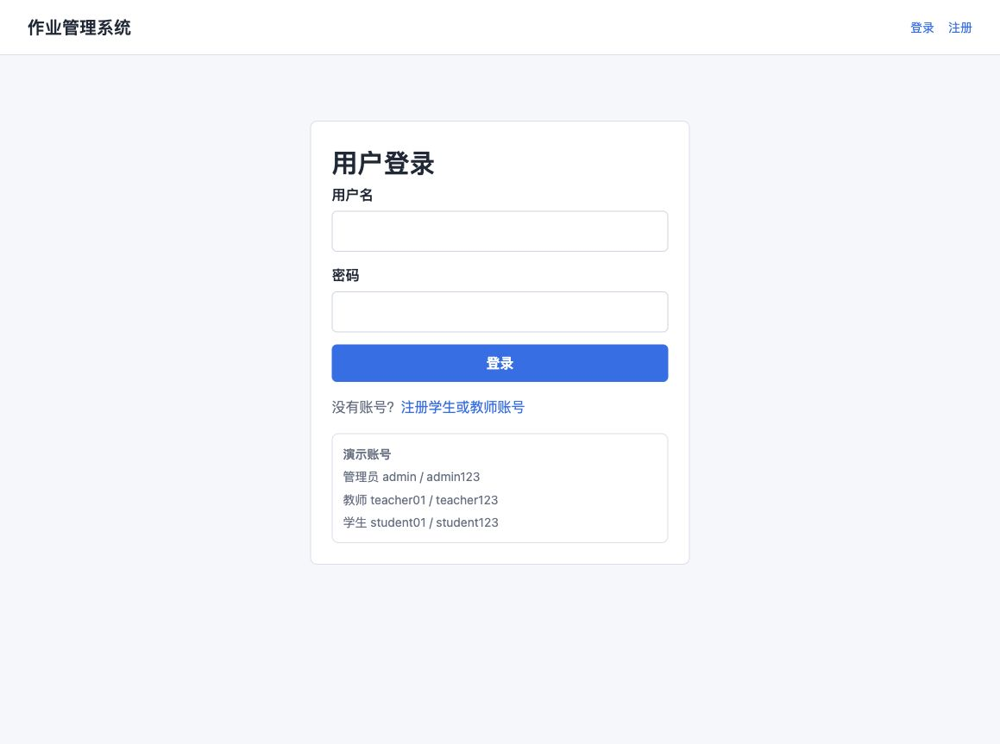
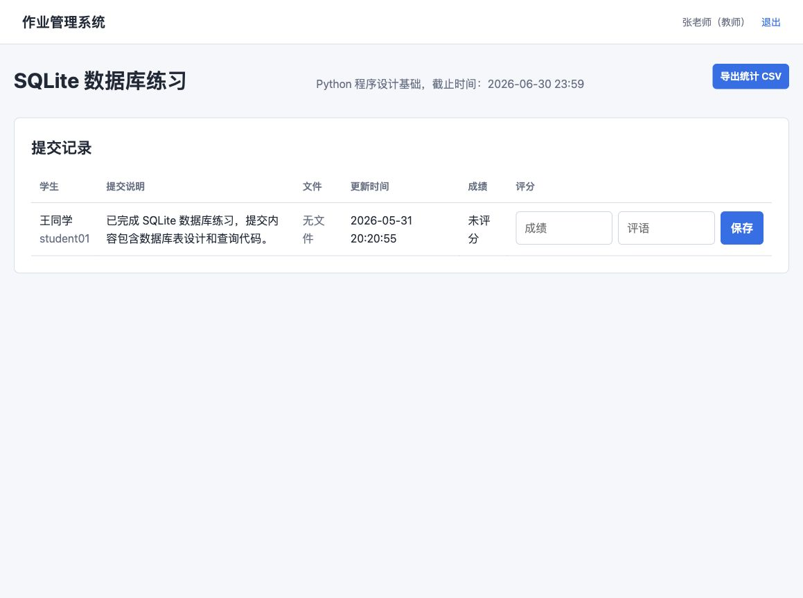
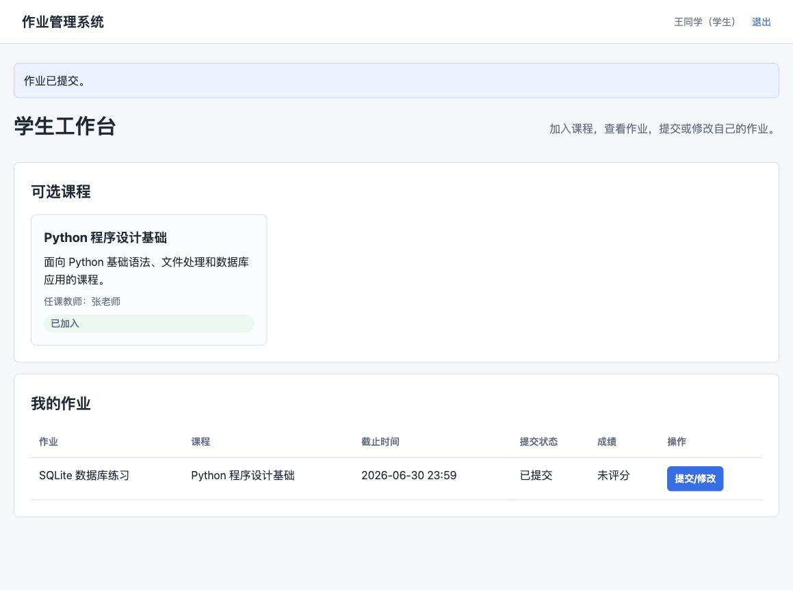

# 作业管理系统用户使用手册

## 第 1 页：启动与登录

### 1. Windows 启动方式

在 Windows 电脑上解压项目后，双击 `run_windows.bat`。脚本会自动完成以下步骤：

1. 检查 Python 环境。
2. 创建 `.venv` 虚拟环境。
3. 安装 Flask 依赖。
4. 检查并初始化 SQLite 数据库。
5. 自动打开浏览器访问系统。

访问地址：

```text
http://127.0.0.1:5000
```

### 2. 默认账号

| 角色 | 用户名 | 密码 |
| --- | --- | --- |
| 管理员 | admin | admin123 |
| 教师 | teacher01 | teacher123 |
| 学生 | student01 | student123 |

登录页面如下：



\newpage

## 第 2 页：管理员使用说明

管理员登录后进入管理员后台，可以查看用户数、课程数、作业数和提交数。


### 教师审核

1. 使用管理员账号登录。
2. 在“用户管理”表格中找到状态为“待审核”的教师账号。
3. 点击“通过”按钮。
4. 教师账号状态变为“正常”后即可登录。

### 停用账号

1. 在用户管理表格中找到需要停用的用户。
2. 点击“停用”按钮。
3. 被停用账号再次登录时，系统会提示账号已停用。

\newpage

## 第 3 页：教师使用说明

教师登录后进入教师工作台。


### 创建课程

1. 在“开设课程”区域填写课程名称。
2. 填写课程说明。
3. 点击“创建课程”。
4. 创建成功后，课程会显示在“我的课程”列表中。

### 布置作业

1. 在“布置作业”区域选择课程。
2. 填写作业标题。
3. 设置截止时间。
4. 填写作业要求。
5. 点击“发布作业”。

### 查看提交与评分

1. 在作业列表中点击“查看提交”。
2. 查看学生提交说明和附件。
3. 在评分栏填写成绩和评语。
4. 点击“保存”。
5. 如需统计，点击“导出统计 CSV”。



\newpage

## 第 4 页：学生使用说明

学生登录后进入学生工作台。


### 加入课程

1. 在“可选课程”区域查看课程。
2. 点击“加入课程”。
3. 加入后课程状态显示为“已加入”。

### 提交作业

1. 在“我的作业”表格中找到需要提交的作业。
2. 点击“提交/修改”。
3. 填写提交说明。
4. 如有附件，点击文件选择框上传。
5. 点击“保存提交”。

提交页面如下：


提交完成后，学生工作台会显示“已提交”。



### 查看成绩

教师评分后，学生在“我的作业”表格中可以看到成绩和评语。

