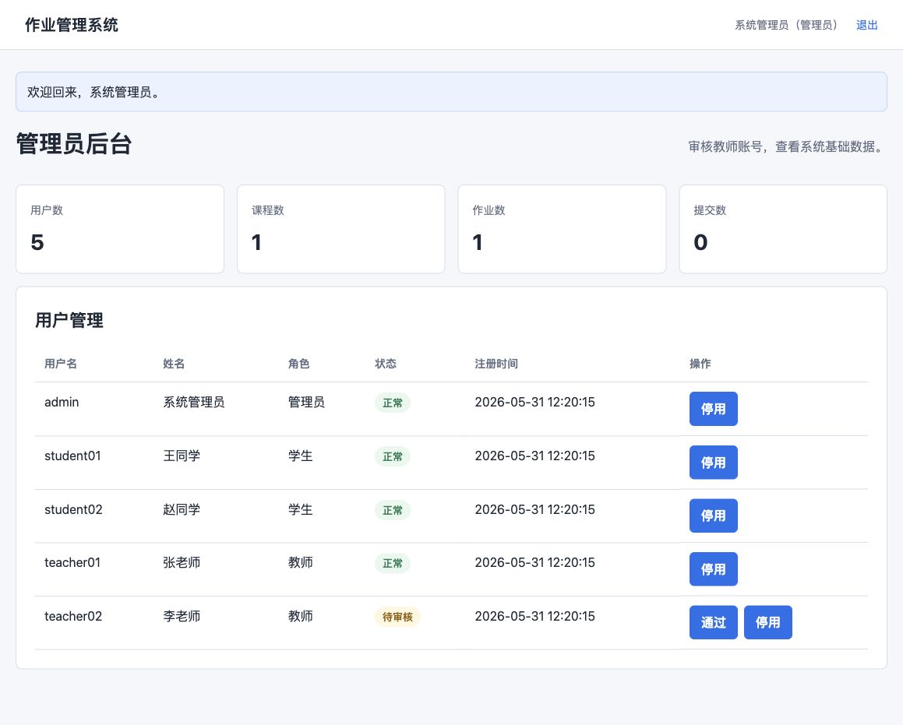
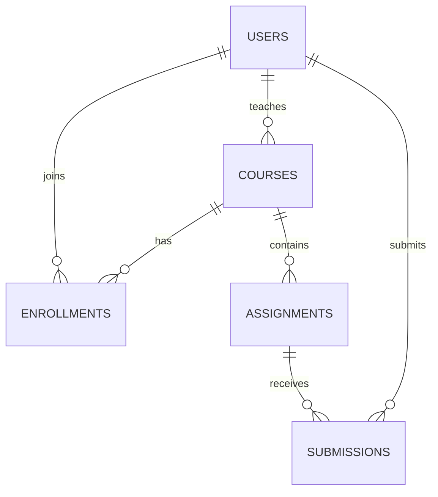
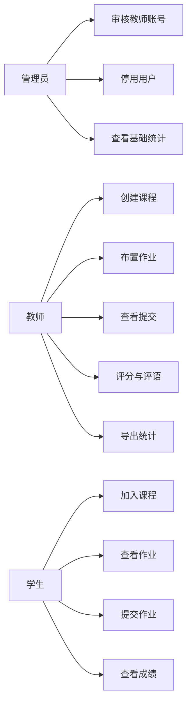
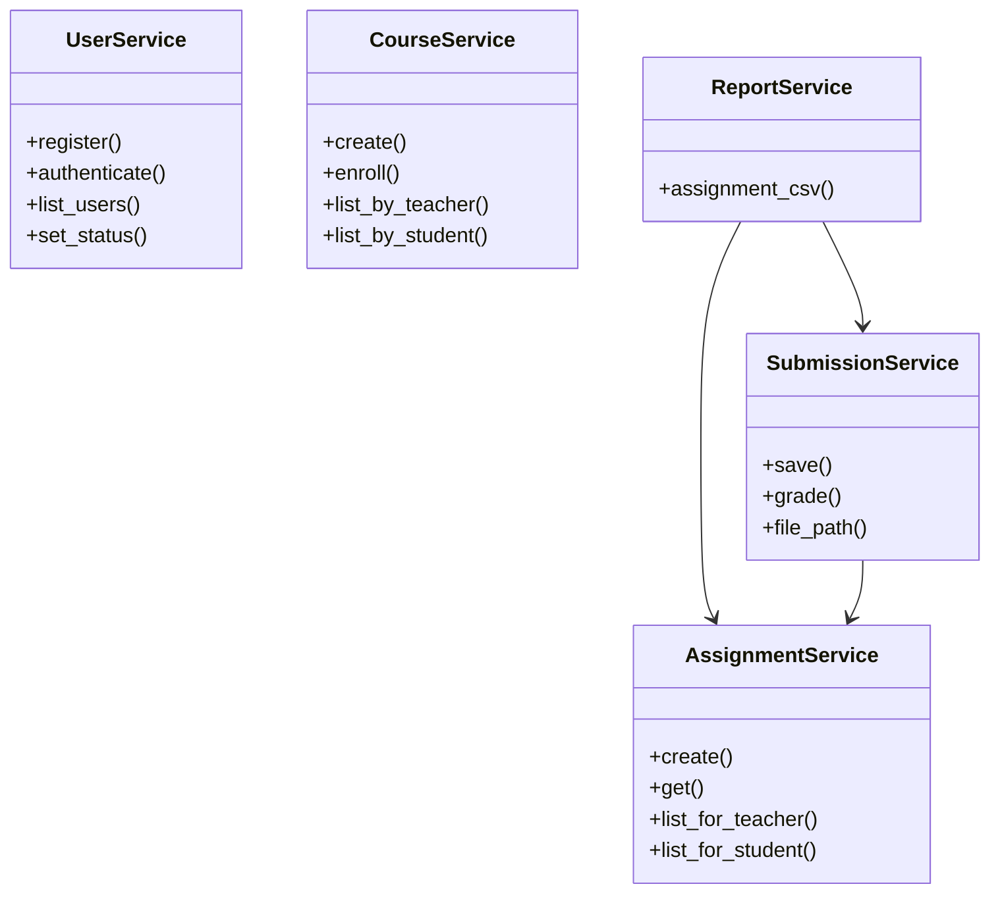
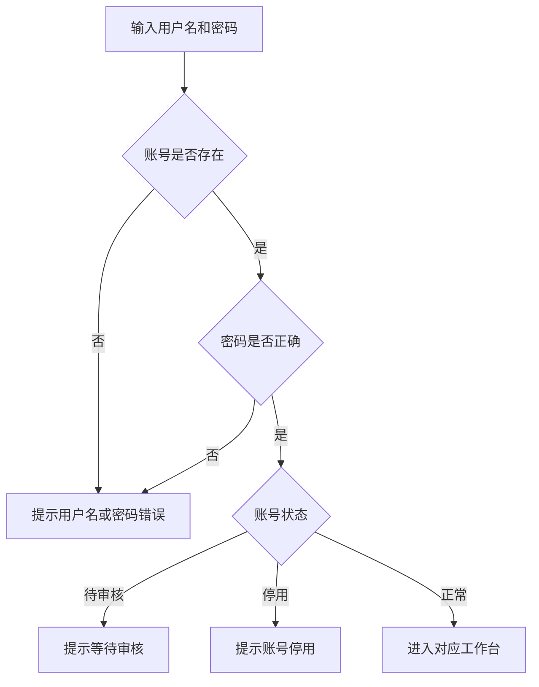
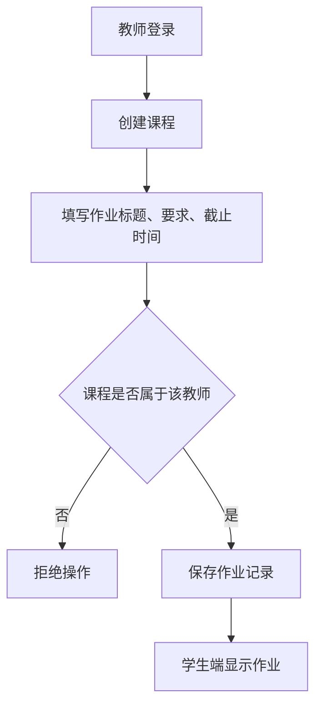
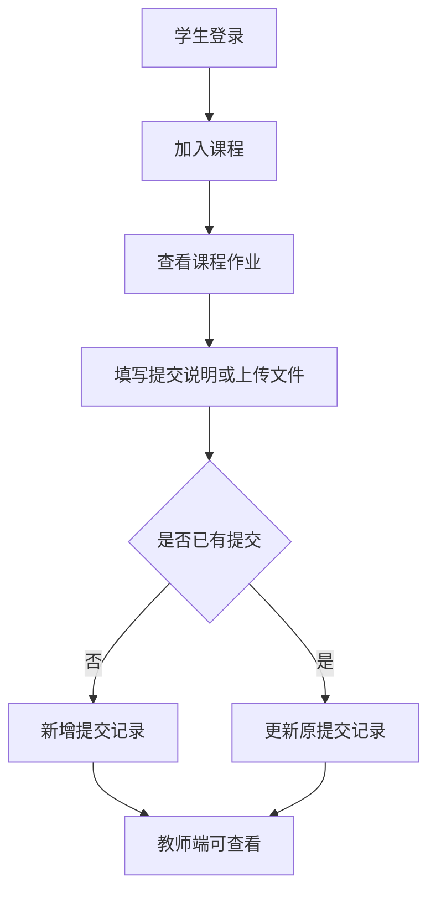
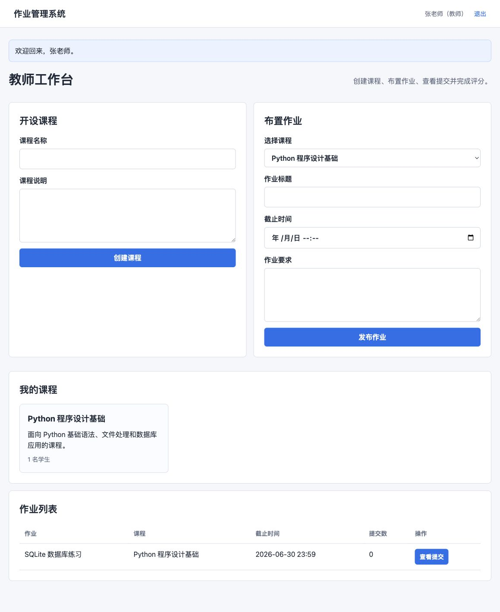
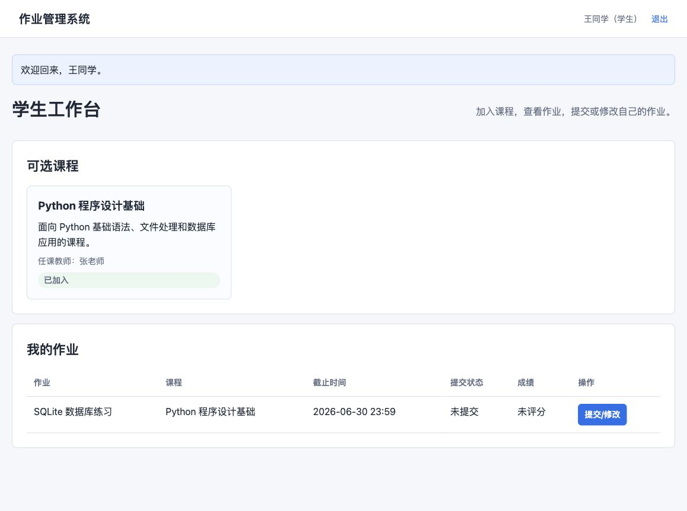
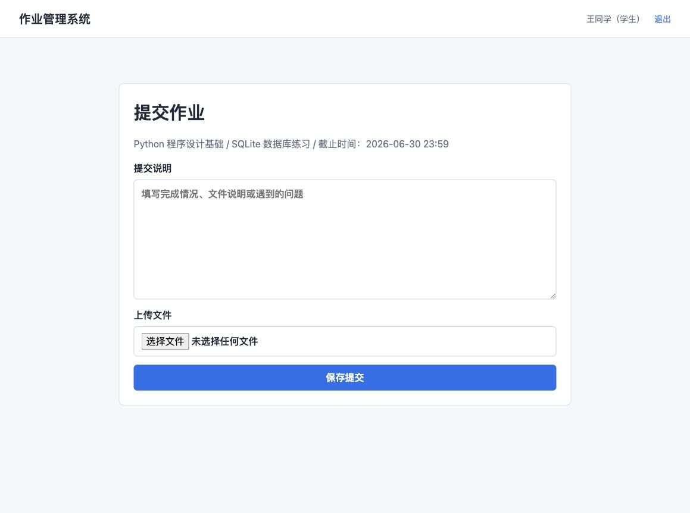

# 基于 Python 的作业管理数据库应用系统设计说明书

项目名称：作业管理系统  
主要技术：Python、Flask、SQLite、HTML/CSS  
系统类型：数据库应用系统  

## 第 1 页：系统概述

本系统面向课程教学中的作业发布、学生提交和教师评分场景，目标是把传统手工收作业、统计提交情况、登记成绩等流程集中到一个 Web 系统中完成。系统采用浏览器访问方式，数据库使用 SQLite，本地即可运行，便于课程答辩和演示。

系统包含三类用户。管理员负责教师身份审核和基础数据管理；教师负责开设课程、布置作业、查看学生提交、下载附件、评分和导出统计；学生负责注册登录、加入课程、查看作业、提交或修改作业、查看成绩和评语。

系统设计重点体现面向对象思想。系统将用户、课程、作业、提交记录等现实对象抽象成数据库表和业务服务类，各类之间通过角色权限和外键关系形成清晰结构。页面层只处理表单和展示，业务逻辑集中在服务类中，数据库访问集中在数据库模块中。

主要功能截图如下：

\newpage

## 第 2 页：需求分析与角色划分

### 1. 管理员角色

管理员是系统后台管理者，主要任务包括：

- 查看系统用户、课程、作业和提交数量。
- 审核教师注册账号。
- 停用异常账号。
- 维护系统演示数据的整体可用状态。

管理员不直接参与课程教学业务，但对教师账号具有审核权限，防止普通用户直接获得教师功能。

### 2. 教师角色

教师是课程和作业的创建者，主要任务包括：

- 登录系统。
- 创建课程并填写课程说明。
- 为自己的课程布置作业。
- 查看学生提交记录。
- 下载学生上传文件。
- 对提交记录进行评分和填写评语。
- 导出作业提交统计 CSV 文件。

教师只能管理自己创建的课程和作业，不能访问其他教师的数据。

### 3. 学生角色

学生是课程作业提交者，主要任务包括：

- 注册并登录系统。
- 查看可选课程并加入课程。
- 查看自己已加入课程下的作业。
- 提交作业说明和附件。
- 在提交后再次修改作业。
- 查看教师评分和评语。

\newpage

## 第 3 页：对象清单

| 对象 | 主要属性 | 主要功能 |
| --- | --- | --- |
| 用户 | 用户名、密码哈希、姓名、角色、状态 | 注册、登录、权限判断、账号审核 |
| 管理员 | 继承用户属性，角色为 admin | 审核教师、停用账号、查看统计 |
| 教师 | 继承用户属性，角色为 teacher | 开课、布置作业、评分、导出 |
| 学生 | 继承用户属性，角色为 student | 选课、提交作业、查看成绩 |
| 课程 | 课程名称、课程说明、教师编号 | 保存课程信息，关联教师和学生 |
| 选课记录 | 课程编号、学生编号 | 表示学生加入某门课程 |
| 作业 | 作业标题、说明、截止时间、课程编号 | 保存教师发布的作业要求 |
| 提交记录 | 作业编号、学生编号、文件名、说明、成绩、评语 | 保存学生提交内容和评分结果 |
| 统计报表 | 作业名称、学生、提交时间、成绩 | 导出 CSV 文件，辅助教师统计 |

对象之间的关系如下：

\newpage

## 第 4 页：用例设计

系统用例围绕三类角色展开。

### 核心用例说明

| 用例 | 参与者 | 前置条件 | 结果 |
| --- | --- | --- | --- |
| 教师审核 | 管理员 | 教师已注册且状态为待审核 | 教师账号变为正常 |
| 创建课程 | 教师 | 教师已登录且账号正常 | 数据库生成课程记录 |
| 布置作业 | 教师 | 教师已创建课程 | 数据库生成作业记录 |
| 提交作业 | 学生 | 学生已加入课程 | 数据库生成或更新提交记录 |
| 作业评分 | 教师 | 学生已有提交记录 | 提交记录保存成绩和评语 |
| 导出统计 | 教师 | 当前作业存在提交记录 | 浏览器下载 CSV 文件 |

\newpage

## 第 5 页：类与模块设计

系统主要类集中在 `assignment_system/services.py` 中。

| 类名 | 职责 | 关键方法 |
| --- | --- | --- |
| UserService | 处理注册、登录、账号状态 | register、authenticate、list_users、set_status |
| CourseService | 处理课程和选课 | create、list_all、list_by_teacher、list_by_student、enroll |
| AssignmentService | 处理作业发布和查询 | create、get、list_for_teacher、list_for_student |
| SubmissionService | 处理提交、文件、评分 | save、list_by_assignment、get、grade、file_path |
| ReportService | 处理统计导出 | assignment_csv |

类之间的调用关系如下：

\newpage

## 第 6 页：数据库设计

数据库采用 SQLite。SQLite 不需要单独安装数据库服务器，适合课程作业、单机演示和 Windows 答辩。数据库文件默认存放在 `data/assignment_system.sqlite3`。

### users 表

| 字段 | 类型 | 说明 |
| --- | --- | --- |
| id | INTEGER | 用户编号 |
| username | TEXT | 登录用户名，唯一 |
| password_hash | TEXT | 密码哈希 |
| name | TEXT | 姓名 |
| role | TEXT | admin、teacher、student |
| status | TEXT | pending、approved、disabled |
| created_at | TEXT | 注册时间 |

### courses 表

| 字段 | 类型 | 说明 |
| --- | --- | --- |
| id | INTEGER | 课程编号 |
| name | TEXT | 课程名称 |
| description | TEXT | 课程说明 |
| teacher_id | INTEGER | 任课教师编号 |
| created_at | TEXT | 创建时间 |

### assignments 表

| 字段 | 类型 | 说明 |
| --- | --- | --- |
| id | INTEGER | 作业编号 |
| course_id | INTEGER | 所属课程 |
| title | TEXT | 作业标题 |
| description | TEXT | 作业要求 |
| deadline | TEXT | 截止时间 |

### submissions 表

| 字段 | 类型 | 说明 |
| --- | --- | --- |
| id | INTEGER | 提交编号 |
| assignment_id | INTEGER | 作业编号 |
| student_id | INTEGER | 学生编号 |
| filename | TEXT | 原始文件名 |
| stored_filename | TEXT | 保存文件名 |
| content | TEXT | 提交说明 |
| score | REAL | 成绩 |
| comment | TEXT | 评语 |

\newpage

## 第 7 页：主要流程设计

### 登录流程

### 教师布置作业流程

### 学生提交作业流程

\newpage

## 第 8 页：前端界面设计

系统前端采用简洁后台式布局，包括顶部导航、消息提示、表单面板、统计卡片、列表表格等组件。整体界面以白色和浅灰为主，按钮使用蓝色，便于区分主要操作。

### 管理员界面

管理员界面包含基础统计卡片和用户管理表格。教师账号待审核时，管理员可以点击“通过”按钮。

### 教师界面

教师界面分为课程创建、作业发布、课程列表、作业列表四部分，保证教师在一个工作台中完成主要操作。

\newpage

## 第 9 页：学生界面与提交界面

学生界面分为“可选课程”和“我的作业”。学生加入课程后，课程下的作业会出现在作业列表中。

学生提交作业时，可以填写文字说明，也可以上传文件。若再次提交，系统会更新原提交记录，方便学生修改作业。

教师查看提交后，可以填写成绩和评语，评分结果会保存到提交记录中。

\newpage

## 第 10 页：安全与运行设计

### 权限控制

系统通过 session 保存登录用户编号，并在路由中使用角色权限检查。管理员页面只允许管理员访问，教师页面只允许教师访问，学生页面只允许学生访问。教师查看作业详情时，还会判断该作业是否属于当前教师。

### 密码保存

系统不直接保存明文密码，而是通过 Werkzeug 提供的哈希函数保存密码摘要。登录时通过哈希校验判断密码是否正确。

### 文件上传

学生上传文件时，系统会使用安全文件名处理，并在保存文件名前追加随机编号，避免不同学生上传同名文件时互相覆盖。

### Windows 兼容

系统提供 `run_windows.bat` 一键运行脚本。脚本会创建虚拟环境、安装依赖、检查数据库并启动服务。数据库检查默认不会清空已有数据，只有手动执行 `python scripts/init_db.py --reset` 才会重置演示数据。

### 打包设计

系统提供 `build_windows_exe.bat` 和 GitHub Actions 工作流。Windows 环境可使用 PyInstaller 生成 `HomeworkSystem.exe`。源码运行是主方案，exe 是答辩备用方案。

