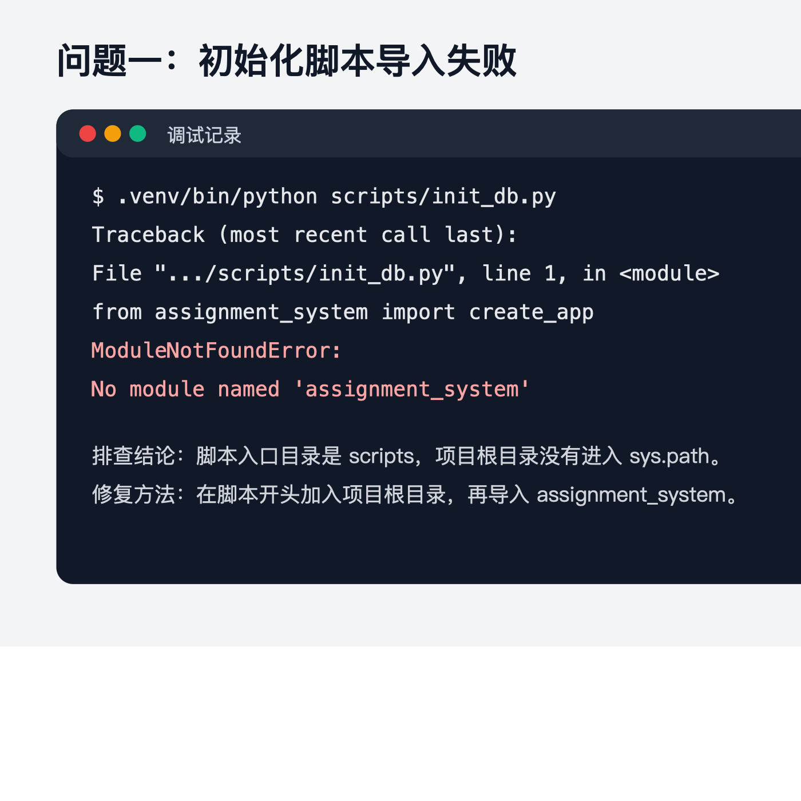
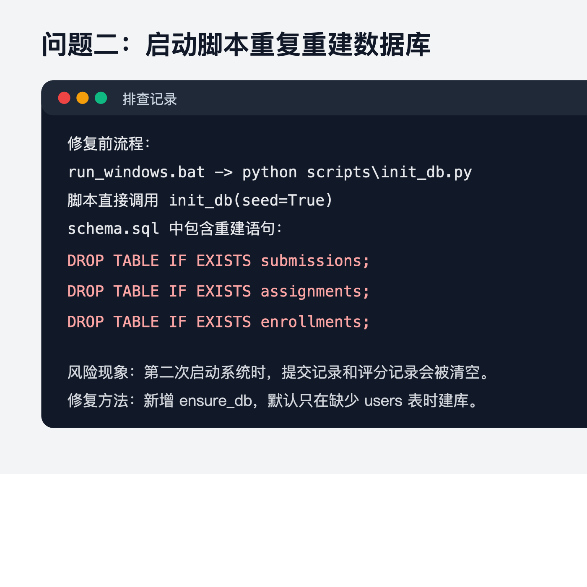
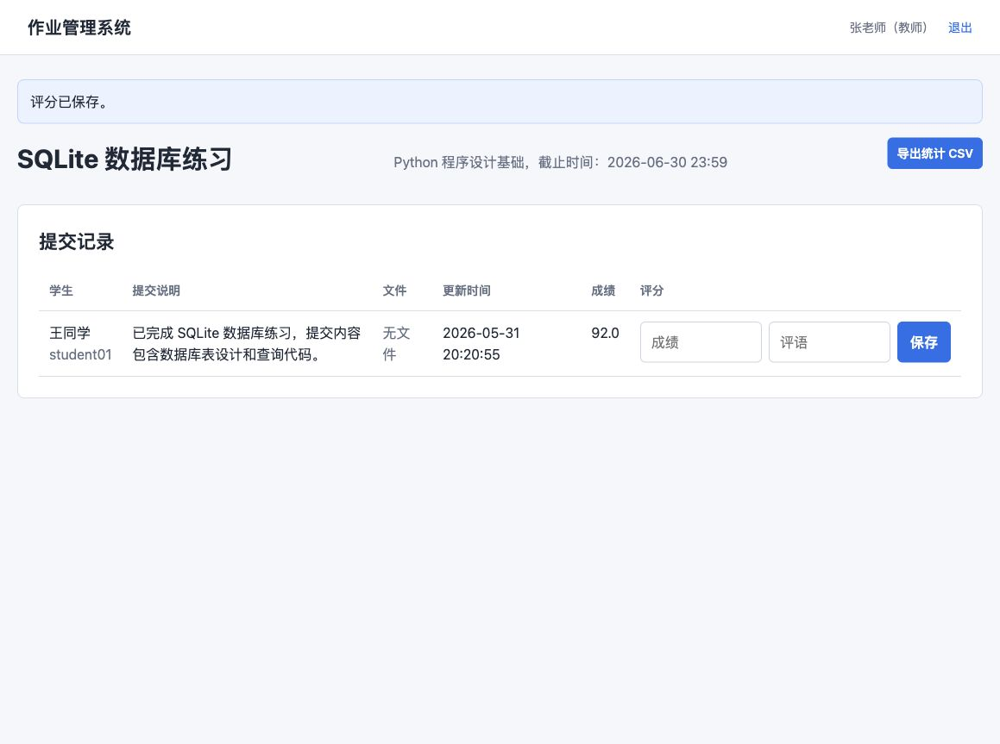

# 作业管理系统过程剖析

## 第 1 页：问题一，初始化脚本导入失败

### 问题现象

在项目根目录执行数据库初始化脚本时，终端出现 `ModuleNotFoundError`，提示找不到 `assignment_system` 模块。



### 排查过程

开始以为是虚拟环境没有安装依赖，但检查后发现 Flask 已经安装。继续观察错误位置，发现报错发生在 `scripts/init_db.py` 第一行导入项目包时。原因是直接运行 `scripts/init_db.py` 时，Python 会把 `scripts` 目录放到模块搜索路径最前面，而不是项目根目录，所以找不到同级目录外的 `assignment_system` 包。

### 修复方法

在脚本开头计算项目根目录，并将根目录加入 `sys.path`，然后再导入系统模块。修复后再次执行初始化脚本，数据库可以正常创建。

\newpage

## 第 2 页：问题二，启动脚本重复重建数据库

### 问题现象

检查 Windows 一键运行流程时发现，`run_windows.bat` 每次启动都会执行 `python scripts\init_db.py`。原来的初始化脚本会直接调用 `init_db(seed=True)`，而 `init_db` 会执行 `schema.sql` 中的 `DROP TABLE` 语句。这样第二次启动系统时，之前提交的作业和评分记录都会被清空。



### 排查过程

先查看 `run_windows.bat`，确认启动前一定会调用初始化脚本。再查看 `scripts/init_db.py`，发现脚本没有区分“首次建库”和“重置数据库”。最后查看 `schema.sql`，发现文件开头包含多个 `DROP TABLE IF EXISTS` 语句，所以问题根源是启动脚本把“重置数据库”当成了“检查数据库”。

### 修复方法

新增 `ensure_db` 方法，只检查数据库中是否存在 `users` 表。如果表不存在，说明是第一次运行，再创建数据库和演示数据；如果表已经存在，就保留原有数据。初始化脚本增加 `--reset` 参数，只有手动执行 `python scripts/init_db.py --reset` 才会清空并重建数据库。

\newpage

## 第 3 页：功能验证过程

修复后进行了以下验证：

1. 管理员账号可以登录后台。
2. 待审核教师显示在用户表中，管理员可以审核。
3. 教师可以创建课程并发布作业。
4. 学生可以加入课程并提交作业。
5. 教师可以查看提交记录，填写成绩和评语。
6. 教师可以导出 CSV 统计文件。
7. 自动化测试通过。

测试命令：

```bash
.venv/bin/python -m unittest discover -s tests -v
```

测试结果：

```text
Ran 2 tests in 1.237s

OK
```

教师评分后的页面如下：



\newpage

## 第 4 页：总结

本次开发过程中，主要问题集中在运行环境和数据持久化两个方面。第一个问题说明脚本直接运行时要注意模块搜索路径；第二个问题说明初始化逻辑不能随意清空数据库，尤其是答辩现场需要多次启动系统时，更要保证数据不会丢失。

通过这两个问题的排查，系统最终形成了更稳定的运行方式：源码运行时自动检查数据库，必要时才初始化；如需重新演示初始数据，可以手动执行重置参数。这样既能保证首次运行方便，也能避免答辩时误删数据。

